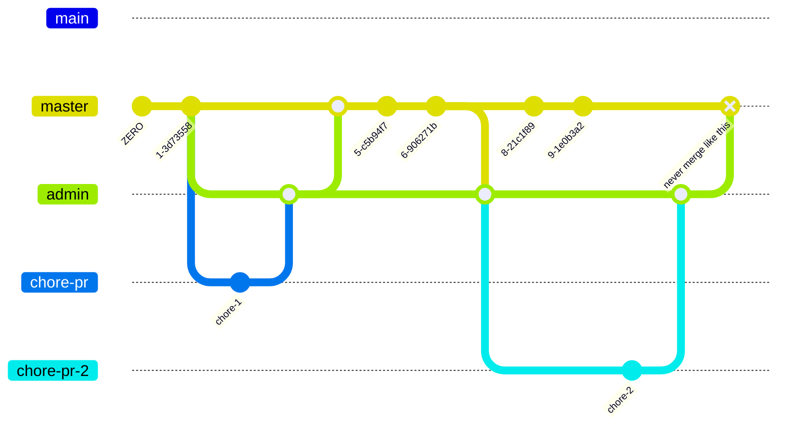
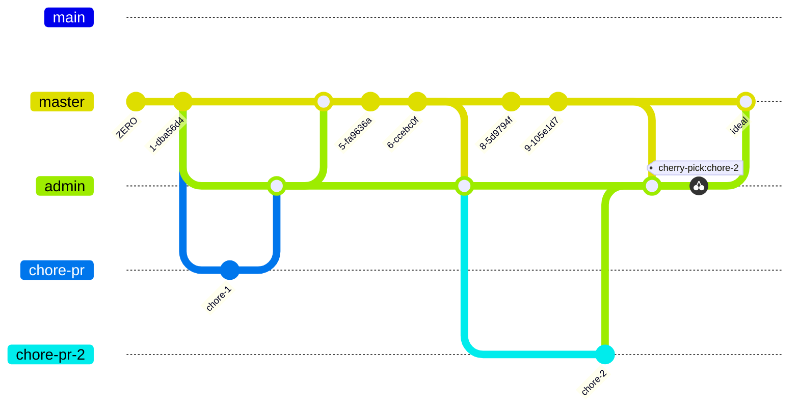

# Chore PR merge

Consider the following git graph:

Let's elaborate on what's happening:

* The `admin` branch is the branch used for "chores". 
* We need it to "track" or "sync" to the master branch as much as possible.
* When `master` gets commits, `admin` should fast-forward to `master`. 
* However, dependabot make automatic pull requests on `admin`. Wherever admin stands. 
 
## Merging

- Ensure that `admin` is on the same commit of `master` before merging the chore PR. If it's not, then move it there. 
- After we've moved it there, consider this: dependabot will have made a PR against an "old version" of admin. It would be nice if we rebased on top of the new version of admin, or "cherry-picked". We should add a comment in the chore PR with the content `@dependabot rebase` and wait for its execution.
- Proceed to the chore PR merge with "Squash and merge", leaving the title, but removing the whole description.
- Check whether the workflow went well for the `admin` branch.
- Fast forward `master` to `admin`.
- (@ddnexus only) If needed: rebase `dev` on the new `master` and check the `dev` workflow.

This would be reflective of the ideal workflow.

