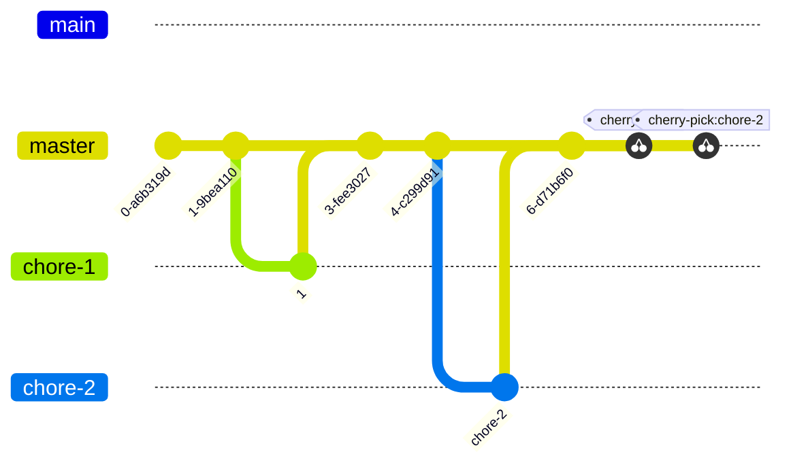

# Chore PR merge

Consider the following git graph:

(The graph above uses "cherry-pick" labels, but you can rebase if you want to.)

The process:

1. Pick the oldest chore PR first
2. Check the tests pass
3. `@dependabot rebase`
4. Check rebase completes (one way or another)
5. If rebased, check tests pass
6. Squash and merge
7. Repeat with the remaining chore PRs

