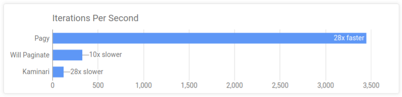
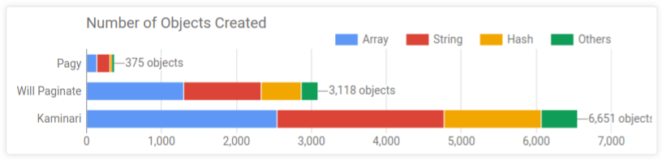
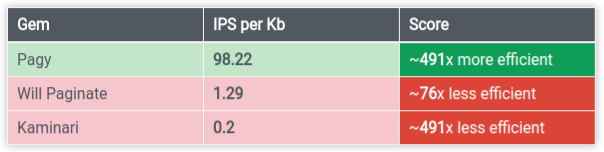

# Pagy

[](https://badge.fury.io/rb/pagy)

Pagy is the ultimate pagination gem that outperforms the others in each and every benchmark and comparison. 

### Benchmarks

The best way to quickly get an idea about its features is comparing it to the other well known gems.

The values shown in the charts below have been recorded while each gem was producing the exact same output: same environment conditions, same task, just different gems _(see the complete [Gems Comparison](http://ddnexus.github.io/pagination-comparison/gems.html))_

#### Pagy is a lot faster



#### Pagy uses a lot less memory


#### Pagy is a lot simpler



#### Pagy is a lot more efficient



_The [IPS/Kb ratio](http://ddnexus.github.io/pagination-comparison/gems.html#efficiency-ratio) is calculated out of speed (IPS) and Memory (Kb): it shows how well each gem uses any Kb of memory it allocates/consumes._ 

#### Pagy does not suffer the typical limitations of the other gems:

- it works with collections/scopes that already used `limit` and `offset`
- it works with both helpers or templates (your choice)
- it raises real `Pagy::OutOfRangeError` exceptions that you can rescue from
- it does not impose any difficult-to-override logic or output

### Features

#### Straightforward code

- Pagy is just ~120 lines of simple ruby, organized in 3 flat modules very easy to understand and use
- it produces its own HTML, URLs, pluralization and interpolation with its own specialized and fast code
- 100% of its methods are public API, accessible and overridable **right where you use them** (no need of monkey patching or subclassing)

#### Totally agnostic

- it doesn't need to know anything about your models, ORM or Storage, so it doesn't add any code to them
- it works with all kinds of collections, even pre-paginated, records, Arrays, JSON data... and just whatever you can count
- it works with all Rack frameworks (Rails, Sinatra, Padrino, ecc.) out of the box 
- it works with any possible non-Rack envoronment by just overriding one or two one-liner methods

#### Simple Usage

You can use pagy in a quite familiar way: 

Paginate your collection in some controller:

```ruby
@pagy, @records = pagy(Product.some_scope)
```

Render the navigation links with a super-fast helper in some view:

```HTML+ERB
<%= pagy_nav(@pagy) %>
```

Or - if you prefer - render the navigation links with a template:

```HTML+ERB
<%= render 'pagy/nav', locals: {pagy: @pagy} %>
```

## Support, Comments and Feature Requests

[](https://gitter.im/ruby-pagy/Lobby?utm_source=badge&utm_medium=badge&utm_campaign=pr-badge&utm_content=badge)

## Useful Links

- [Documentation](https://ddnexus.github.io/pagy/index)
- [Pagination Comparison App](http://github.com/ddnexus/pagination-comparison)

## Help Wanted

Pagy is a fresh project and your help would be great. If you like it, you have a few options to contribute:

- write a tutorial or a post or even just a tweet (pagy is young and needs to be known)
- write a "How To" topic (the documentation is covering the basics and there is a lot of space for additions)
- submit a pull request to make pagy even faster, save more memory or improve its usability
- create an issue if anything should be improved/fixed

## License

The gem is available as open source under the terms of the [MIT License](https://opensource.org/licenses/MIT).
