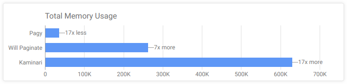
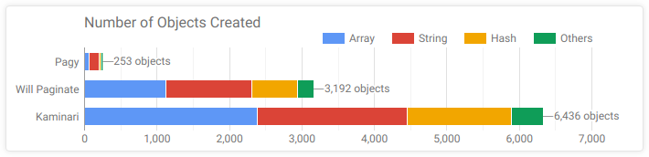
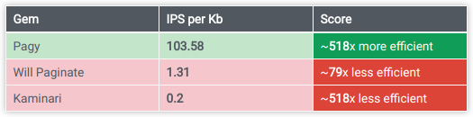
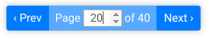

# Pagy

[](https://badge.fury.io/rb/pagy) [](https://travis-ci.org/ddnexus/pagy/branches)

Pagy is the ultimate pagination gem that outperforms the others in each and every benchmark and comparison.

## Benchmarks

The best way to quickly get an idea about Pagy is comparing it to the other well known gems.

The values shown in the charts below have been recorded while each gem was producing the exact same output: same environment conditions, same task, just different gems _(see the [Detailed Gems Comparison](http://ddnexus.github.io/pagination-comparison/gems.html))_

### Faster

[](https://ddnexus.github.io/pagination-comparison/gems.html#ips-benchmark)

### Less Memory

[](https://ddnexus.github.io/pagination-comparison/gems.html#memory-profile)

### Simpler

[](https://ddnexus.github.io/pagination-comparison/gems.html#memory-profile)

### More Efficient

[](https://ddnexus.github.io/pagination-comparison/gems.html#efficiency-ratio)

_The [IPS/Kb ratio](http://ddnexus.github.io/pagination-comparison/gems.html#efficiency-ratio) is calculated out of speed (IPS) and Memory (Kb): it shows how well each gem uses any Kb of memory it allocates/consumes._

#### Disclaimer

Please, notice that benchmarking and profiling the pagination gems in a working app environment is quite a tricky task.

If you compare Pagy in your own app and don't notice much of a difference, your benchmarks are most likely not isolating the pagination code from the rest of your app.

Please check the [Benchmarks and Memory Profiles Source](http://github.com/ddnexus/pagination-comparison) for a working example about how to properly compare the gems. Feel free to ask [here](https://gitter.im/ruby-pagy/Lobby) if you need help.

## Features

### Straightforward Code

- Pagy has a very slim core code of just ~100 line of simple ruby, organized in 3 flat modules very easy to understand and use _(see [more...](https://ddnexus.github.io/pagy/api))_
- It has a quite fat set of optional extras that you can explicitly require for very efficient and modular customization _(see [extras](https://ddnexus.github.io/pagy/extras))_
- It has no dependencies: it produces its own HTML, URLs, i18n with its own specialized and fast code _(see [why...](https://ddnexus.github.io/pagy/index#specialized-code-instead-of-generic-helpers))_
- 100% of its methods are public API, accessible and overridable **right where you use them** (no need of monkey-patching)
- 100% test coverage for core code and extras

### Totally Agnostic

- The `Pagy` class doesn't need to know anything about your models, ORM or storage, so it doesn't add any code to them _(see [why...](https://ddnexus.github.io/pagy/index#stay-away-from-the-models))_
- It works with all kinds of collections, even pre-paginated, records, Arrays, JSON data... and just whatever you can count _(see [how...](https://ddnexus.github.io/pagy/how-to#paginate-any-collection))_
- Pagy works with the most popular Rack frameworks (Rails, Sinatra, Padrino, ecc.) out of the box _(see [more...](https://ddnexus.github.io/pagy/how-to#environment-assumptions))_
- It works also with any possible non-Rack environment by just overriding one or two two-lines methods _(see [more...](https://ddnexus.github.io/pagy/how-to#environment-assumptions))_

### Unlike the other gems

- Pagy is very modular and does not load nor execute unnecessary code in your app _(see [why...](https://ddnexus.github.io/pagy/how-to#global-configuration))_
- It works with collections/scopes that already used `limit` and `offset` _(see [how...](https://ddnexus.github.io/pagy/how-to#paginate-a-pre-offsetted-and-pre-limited-collection))_
- It works with helpers or templates _(see [more...](https://ddnexus.github.io/pagy/how-to#using-templates))_
- It raises real `Pagy::OverflowError` exceptions that you can rescue from _(see [how...](https://ddnexus.github.io/pagy/how-to#handling-pagyoutofrangeerror-exception))_ or use the [overflow extra](http://ddnexus.github.io/pagy/extras/overflow) for a few ready to use common behaviors
- It does not impose any difficult-to-override logic or output _(see [why...](https://ddnexus.github.io/pagy/index#really-easy-to-customize))_

### Easy to use

You can use Pagy in a quite familiar way:

Paginate your collection in some controller:

```ruby
@pagy, @records = pagy(Product.some_scope)
```

Render the navigation links with a super-fast helper in some view:

```erb
<%== pagy_nav(@pagy) %>
```

Or - if you prefer - render the navigation links with a template:

```erb
<%== render 'pagy/nav', locals: {pagy: @pagy} %>
```

_(see [Quick Start](https://ddnexus.github.io/pagy/how-to#quick-start) for more details)_

## Easy to extend

Use the official extras, or write your own in just a few lines. Extras add special options and manage different components, behaviors, Frontend or Backend environments... usually by just requiring them:

### Backend Extras

- [array](http://ddnexus.github.io/pagy/extras/array): Paginate arrays efficiently, avoiding expensive array-wrapping and without overriding
- [countless](http://ddnexus.github.io/pagy/extras/countless): Paginate without the need of any count, saving one query per rendering
- [elasticsearch_rails](http://ddnexus.github.io/pagy/extras/elasticsearch_rails): Paginate `ElasticsearchRails::Results` objects efficiently, avoiding expensive object-wrapping and without overriding
- [searchkick](http://ddnexus.github.io/pagy/extras/searchkick): Paginate `Searchkick::Results` objects efficiently, avoiding expensive object-wrapping and without overriding

### Frontend Extras

- [bootstrap](http://ddnexus.github.io/pagy/extras/bootstrap): Add nav, responsive and compact helpers for the Bootstrap [pagination component](https://getbootstrap.com/docs/4.1/components/pagination)
- [bulma](http://ddnexus.github.io/pagy/extras/bulma): Add nav, responsive and compact helpers for the Bulma CSS [pagination component](https://bulma.io/documentation/components/pagination)
- [foundation](http://ddnexus.github.io/pagy/extras/foundation): Add nav, responsive and compact helpers for the Foundation [pagination component](https://foundation.zurb.com/sites/docs/pagination.html)
- [materialize](http://ddnexus.github.io/pagy/extras/materialize): Add nav responsive and compact helpers for the Materialize CSS [pagination component](https://materializecss.com/pagination.html)
- [plain](http://ddnexus.github.io/pagy/extras/plain): Add responsive and compact plain/unstyled helpers
- [semantic](http://ddnexus.github.io/pagy/extras/semantic): Add nav, responsive and compact helpers for the Semantic UI CSS [pagination component](https://semantic-ui.com/collections/menu.html)

### Feature Extras

- [i18n](http://ddnexus.github.io/pagy/extras/i18n): Use the `I18n` gem instead of the pagy implementation
- [items](http://ddnexus.github.io/pagy/extras/items): Allow the client to request a custom number of items per page with an optional selector UI
- [overflow](http://ddnexus.github.io/pagy/extras/overflow): Allow for easy handling of overflowing pages
- [support](http://ddnexus.github.io/pagy/extras/support): Extra support for features like: incremental, infinite, auto-scroll pagination
- [trim](http://ddnexus.github.io/pagy/extras/trim): Remove the `page=1` param from the first page link

### Alternative components

Besides the classic pagination `nav`, Pagy offers a few ready to use alternatives like:

- [compact nav](http://ddnexus.github.io/pagy/extras/plain#compact-navs): An alternative UI that combines the pagination feature with the navigation info in one compact element:<br>

- [responsive nav](http://ddnexus.github.io/pagy/extras/plain#responsive-navs): On resize, the number of page links adapts in real-time to the available window or container width:<br>

## Resources

### GoRails Screencast

[](https://gorails.com/episodes/pagination-with-pagy-gem?autoplay=1)

__* Notice__: the `pagy_nav_bootstrap` helper used in the screencast has been renamed to `pagy_bootstrap_nav` in version 2.0

### Posts and Tutorials

- [Migrating from WillPaginate and Kaminari](https://ddnexus.github.io/pagy/migration-tips) (practical guide)
- [Pagination with Pagy](https://www.imaginarycloud.com/blog/paginating-ruby-on-rails-apps-with-pagy) by Tiago Franco
- [Stateful Tabs with Pagy](https://www.imaginarycloud.com/blog/how-to-paginate-ruby-on-rails-apps-with-pagy) by Chris Seelus
- [Quick guide for Pagy with Sinatra and Sequel](https://medium.com/@vfreefly/how-to-use-pagy-with-sequel-and-sinatra-157dfec1c417) by Victor Afanasev
- [Integrating Pagy with Hanami](http://katafrakt.me/2018/06/01/integrating-pagy-with-hanami/) by Paweł Świątkowski
- [Detailed Gems Comparison](https://ddnexus.github.io/pagination-comparison/gems.html) (charts and analysis)
- [Benchmarks and Memory Profiles Source](http://github.com/ddnexus/pagination-comparison) (Rails app repository)

### Docs

- [Quick Start](https://ddnexus.github.io/pagy/how-to#quick-start)
- [Documentation](https://ddnexus.github.io/pagy/index)
- [Changelog](https://github.com/ddnexus/pagy/blob/master/CHANGELOG.md)

### Support and Feedback

[Chat on Gitter](https://gitter.im/ruby-pagy/Lobby)


## Please Star and Share!

Pagy is young and needs to be known, and **you** can really help, even with just a click on the star, or sharing a tweet with friends and colleagues. A big thank you for your support!

## Help Wanted

Pagy is a fresh project and your help would be great. If you like it, you have a few options to contribute:

- Create an issue if anything should be improved/fixed
- Submit a pull request to improve Pagy
- Submit some cool extra
- Submit your translation if your language is missing from the [dictionary files](https://github.com/ddnexus/pagy/blob/master/lib/locales)
- Write a Tutorial or a "How To" topic

## Versioning, Branches and Pull Requests

Pagy follows the [Semantic Versioning 2.0.0](https://semver.org/). Please, check the [Changelog](https://github.com/ddnexus/pagy/blob/master/CHANGELOG.md) for breaking changes introduced by mayor versions.

The `master` branch is the latest rubygem-published release (plus changes that don't affect the actual gem behavior, e.g. doc, tests). You should use it as the base branch for pull requests, because it will not be force-rebased.

The `dev` branch is kept rebased on top of `master`, so expect it to be force-rebased (i.e. do not use it as the base for your commits). Use `dev` as a preview for trying the new code that will be merged in the next release, but please, don't use it as the base branch for pull requests.

## Credits

Many thanks to:

- [Imaginary Cloud](https://www.imaginarycloud.com), for continually publishing high-interest articles and helping share Pagy through their fantastic blog
- [JetBrains](http://www.jetbrains.com) for their free OpenSource license
- [The Contributors](https://github.com/ddnexus/pagy/graphs/contributors) for all the smart code and suggestions merged in the project
- [The Stargazers](https://github.com/ddnexus/pagy/stargazers) for showing their support

## License

The gem is available as open source under the terms of the [MIT License](https://opensource.org/licenses/MIT).
