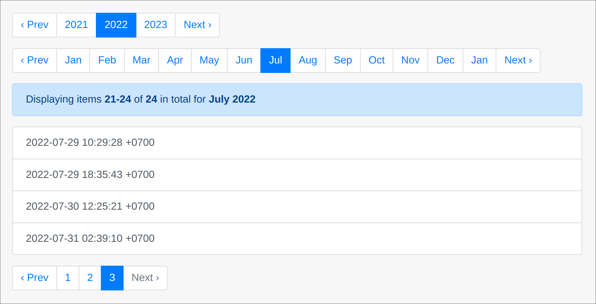
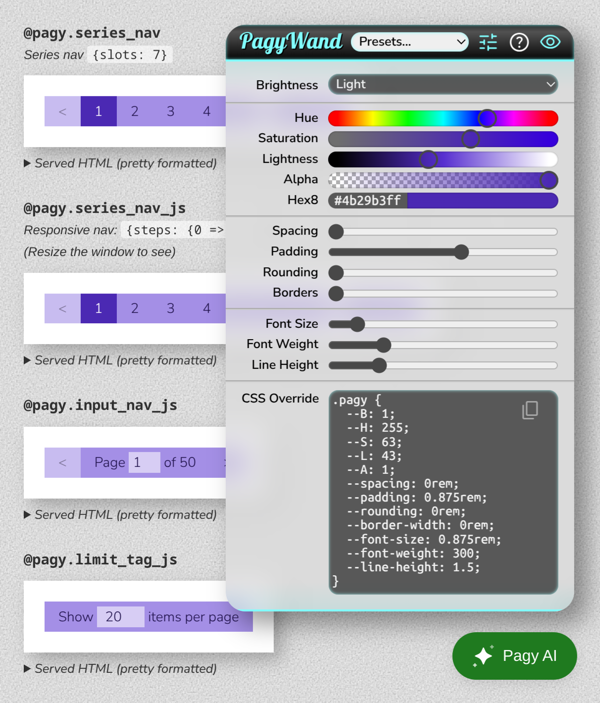

<span>[](https://rubygems.org/gems/pagy)</span> <span>
[](https://endoflife.date/ruby)</span> <span>
[](https://github.com/ddnexus/pagy/actions/workflows/ruby-test.yml)</span> <span>
[](https://github.com/ddnexus/pagy/actions/workflows/e2e-test.yml)</span> <span>
</span> <span>
</span> <span>
[](http://opensource.org/licenses/MIT)</span> <span>
[](https://github.com/ddnexus/pagy/commits/master/)</span> <span>
[](https://rubygems.org/gems/pagy)</span> <span>
[](https://github.com/ddnexus/pagy/stargazers)</span> <span>
[](https://gurubase.io/g/pagy)</span>

# 

<h2><br/>Pagy the leaping gem!</h2>

_Agnostic pagination in plain ruby_

<br/>

<!-- whats_new_start -->

<a href="https://ddnexus.github.io/pagy/sandbox/playground/#demo-app">
  
</a><br><br>

## Version 43.0.0 (leap)

We needed a leap version to unequivocally segnaling that it's not just a major version: it's a complete redesign of the legacy
code at all levels, usage and API included.

**Why 43?** Because it's exactly one step beyond _"The answer to the ultimate question of life, the Universe, and everything."_ 😉

#### Improvements

- **New [Keynav](https://ddnexus.github.io/pagy/toolbox/paginators/keynav_js) Pagination**
  - The pagy-exclusive technique using the fastest [keyset](https://ddnexus.github.io/pagy/toolbox/paginators/keyset) pagination alongside all frontend helpers.
- **New interactive dev-tools**
  - New [PagyWand](https://ddnexus.github.io/pagy/resources/stylesheets/#pagy-wand) to integrate the pagy CSS with your app's themes.
  - New **Pagy AI** available inside docs and your own app.
- **Intelligent automation**
  - [Configuration](https://ddnexus.github.io/pagy/resources/initializer/) requirements reduced by 99%.
  - Simplified [JavaScript](https://ddnexus.github.io/pagy/resources/javascript) setup.
  - Automatic [I18n](https://ddnexus.github.io/pagy/resources/i18n) loading.
- **[Simpler API](https://github.com/ddnexus/pagy#examples)**
  - You solely need the [pagy](https://ddnexus.github.io/pagy/toolbox/paginators) method and the [@pagy](https://ddnexus.github.io/pagy/toolbox/helpers) instance to paginate any collection and
    use any navigation tag and helper.
  - Methods are autoloaded only if used and consume no memory otherwise.
  - Methods have narrower scopes and can be [overridden](https://ddnexus.github.io/pagy/guides/how-to#override-pagy-methods) without deep knowledge.
- **New [documentation](https://ddnexus.github.io/pagy/guides/quick-start)**
  - Very concise, straightforward, easy to navigate and understand.

Take a look at the [Examples](#examples) for a quick overview.
<!-- whats_new_end -->

<br/>

### <span style="font-size: .65em; vertical-align: middle">💚</span> v3 was already quite good...

[](https://ddnexus.github.io/pagination-comparison/gems.html#ips-benchmark) [](https://ddnexus.github.io/pagination-comparison/gems.html#memory-profile) [](https://ddnexus.github.io/pagination-comparison/gems.html#memory-profile) [](https://ddnexus.github.io/pagination-comparison/gems.html#efficiency-ratio)

<br/>

### <span style="font-size: .65em; vertical-align: middle">💚</span> Now it's more... with less

- Compatible with all environments and collection types
- It can use OFFSET, COUNTLESS, KEYSET, KEYNAV, CALENDAR pagination techniques
- It supports server-side rendering or faster client-side rendering for popular CSS frameworks and APIs.
- It autoloads ONLY the methods that you actually use, with almost zero config
- It boasts 100% test coverage for Ruby, HTML, and JavaScript end-to-end (E2E)

<br/>

### <span style="font-size: .65em; vertical-align: middle">💚</span> Examples

##### Pagination code

```rb
# Include pagy in your code (usually application_controller.rb)
include Pagy::Method

# Offset-based pagination
@pagy, @records = pagy(:offset, Product.all)

# Keyset-based pagination (fastest technique)
@pagy, @records = pagy(:keyset, Product.order(my_order).all)

# Paginate your collection with one of several paginators
@pagy, @records = pagy(...)
``` 

_See all the available [paginators](https://ddnexus.github.io/pagy/toolbox/paginators/#paginators)_

##### JSON:API pagination

```ruby
# JSON:API nested query string. E.g.: ?page[number]=2&page[size]=100
@pagy, @records = pagy(:offset, Product.all, jsonapi: true)
@pagy, @records = pagy(:keyset, Product.order(my_order).all, jsonapi: true)
render json: { links: @pagy.urls_hash, data: @records }
```

##### JSON-client pagination

```ruby
render json: { pagy: @pagy.data_hash, data: @records }
```

##### Search server pagination

```rb
# Extend your models (e.g. application_record.rb)
extend Pagy::Search

# Paginate with pagy:
search           = Product.pagy_search(params[:q])
@pagy, @response = pagy(:elasticsearch_rails, search)
@pagy, @results  = pagy(:meilisearch, search)
@pagy, @results  = pagy(:searchkick, search)

# Or get pagy from paginated results:
@results = Product.search(params[:q])
@pagy    = pagy(:elasticsearch_rails, @results)
@pagy    = pagy(:meilisearch, @results)
@pagy    = pagy(:searchkick, @results)
```

##### Calendar pagination

Combines `time-range` and `offset` pagination.

_(Available time units: year, quarter, month, week, and day)_

<br/>

```ruby
@calendar, @pagy, @records = pagy(:calendar, collection, year: {}, month: {}, offset: {})
```

```ERB
<%== @calendar[:year].series_nav(:bootstrap) %>
<%== @calendar[:month].series_nav(:bootstrap) %>
<%== @pagy.info_tag %>
...
<%== @pagy.series_nav(:bootstrap) %>
```

##### Server side rendering

##### `series_nav` 

Default `:pagy`, `:bootstrap` and `:bulma` styles shown.

<br/>
<br/>
<br/>

```erb
<!-- Render client side nav bar helpers with different html and styles -->
<%== @pagy.series_nav %> <!-- pagy style -->
<%== @pagy.series_nav(:bootstrap) %>
<%== @pagy.series_nav(:bulma) %>
```

##### Client side rendering

```rb
# pagy.rb initializer
javascript_dir = Rails.root.join('app/javascripts')
Pagy.sync_javascript(javascript_dir, 'pagy.mjs') if Rails.env.development?
```

##### `series_nav_js` 

**Faster and responsive**

Dynamically fills the container width.

<br/>
<br/>

```erb
<!-- Render client side nav bar helpers with different html and styles -->
<%== @pagy.series_nav_js %> <!-- pagy style -->
<%== @pagy.series_nav_js(:bootstrap) %>
<%== @pagy.series_nav_js(:bulma) %>
```

##### `input_nav_js` 

**Fastest!** Combines navigation and info in minimum space.

<br/>

```erb
<!-- Render client side nav inout helpers with different html and styles -->
<%== @pagy.input_nav_js %> <!-- pagy style -->
<%== @pagy.input_nav_js(:bootstrap) %>
<%== @pagy.input_nav_js(:bulma) %>
```

### Pagy Wand

Integrate pagy with your app's themes interactively. You need only a single line in your page/layout `head` to get the Pagy Wand and the Pagy AI:

```erb
<%== Pagy.dev_tags %>
```

<br/>

<a href="https://ddnexus.github.io/pagy/sandbox/playground/#demo-app">
  
</a><br><br>

### <span style="font-size: .65em; vertical-align: middle">💚</span> Support and Docs

- [Quick Start](https://ddnexus.github.io/pagy/guides/quick-start)
- [How To (quick recipes)](https://ddnexus.github.io/pagy/guides/how-to/)
- [Migrate from WillPaginate and Kaminari](https://ddnexus.github.io/pagy/guides/migration-guide) (practical guide)
- [Discussions](https://github.com/ddnexus/pagy/discussions/categories/q-a)
- [Issues](https://github.com/ddnexus/pagy/issues)
- [Changelog](https://ddnexus.github.io/pagy/changelog)

<br/>

### Top 💯 Contributors

<!-- top100_start -->

[](https://github.com/ddnexus/pagy/commits?author=ddnexus)[](https://github.com/ddnexus/pagy/commits?author=benkoshy)[](https://github.com/ddnexus/pagy/commits?author=grosser)[](https://github.com/ddnexus/pagy/commits?author=Earlopain)[](https://github.com/ddnexus/pagy/commits?author=workgena)[](https://github.com/ddnexus/pagy/commits?author=espen)[](https://github.com/ddnexus/pagy/commits?author=enzinia)[](https://github.com/ddnexus/pagy/commits?author=sunny)[](https://github.com/ddnexus/pagy/commits?author=molfar)[](https://github.com/ddnexus/pagy/commits?author=bquorning)[](https://github.com/ddnexus/pagy/commits?author=djpremier)[](https://github.com/ddnexus/pagy/commits?author=simonneutert)[](https://github.com/ddnexus/pagy/commits?author=tersor)[](https://github.com/ddnexus/pagy/commits?author=thomasklemm)[](https://github.com/ddnexus/pagy/commits?author=gamafranco)[](https://github.com/ddnexus/pagy/commits?author=tiagotex)[](https://github.com/ddnexus/pagy/commits?author=wimdavies)[](https://github.com/ddnexus/pagy/commits?author=renshuki)[](https://github.com/ddnexus/pagy/commits?author=berniechiu)[](https://github.com/ddnexus/pagy/commits?author=747)[](https://github.com/ddnexus/pagy/commits?author=ashmaroli)[](https://github.com/ddnexus/pagy/commits?author=cseelus)[](https://github.com/ddnexus/pagy/commits?author=sabljak)[](https://github.com/ddnexus/pagy/commits?author=petergoldstein)[](https://github.com/ddnexus/pagy/commits?author=rainerborene)[](https://github.com/ddnexus/pagy/commits?author=yenshirak)[](https://github.com/ddnexus/pagy/commits?author=rbngzlv)[](https://github.com/ddnexus/pagy/commits?author=WilliamHorel)[](https://github.com/ddnexus/pagy/commits?author=okuramasafumi)[](https://github.com/ddnexus/pagy/commits?author=olieidel)[](https://github.com/ddnexus/pagy/commits?author=olleolleolle)[](https://github.com/ddnexus/pagy/commits?author=PedroAugustoRamalhoDuarte)[](https://github.com/ddnexus/pagy/commits?author=pedrocarmona)[](https://github.com/ddnexus/pagy/commits?author=peter50216)[](https://github.com/ddnexus/pagy/commits?author=rafaeelaudibert)[](https://github.com/ddnexus/pagy/commits?author=rafaelmontas)[](https://github.com/ddnexus/pagy/commits?author=rogermarlow)[](https://github.com/ddnexus/pagy/commits?author=Tolchi)[](https://github.com/ddnexus/pagy/commits?author=serghost)[](https://github.com/ddnexus/pagy/commits?author=artplan1)[](https://github.com/ddnexus/pagy/commits?author=woller)[](https://github.com/ddnexus/pagy/commits?author=sk8higher)[](https://github.com/ddnexus/pagy/commits?author=muhammadnawzad)[](https://github.com/ddnexus/pagy/commits?author=ronald)[](https://github.com/ddnexus/pagy/commits?author=achmiral)[](https://github.com/ddnexus/pagy/commits?author=mauro-ni)[](https://github.com/ddnexus/pagy/commits?author=borama)[](https://github.com/ddnexus/pagy/commits?author=creativetags)[](https://github.com/ddnexus/pagy/commits?author=mcary)[](https://github.com/ddnexus/pagy/commits?author=marckohlbrugge)[](https://github.com/ddnexus/pagy/commits?author=fluser)[](https://github.com/ddnexus/pagy/commits?author=maful)[](https://github.com/ddnexus/pagy/commits?author=AngelGuerra)[](https://github.com/ddnexus/pagy/commits?author=tr4b4nt)[](https://github.com/ddnexus/pagy/commits?author=tiejianluo)[](https://github.com/ddnexus/pagy/commits?author=szTheory)[](https://github.com/ddnexus/pagy/commits?author=smoothdvd)[](https://github.com/ddnexus/pagy/commits?author=rhodes-david)[](https://github.com/ddnexus/pagy/commits?author=radinreth)[](https://github.com/ddnexus/pagy/commits?author=pranavbabu)[](https://github.com/ddnexus/pagy/commits?author=okliv)[](https://github.com/ddnexus/pagy/commits?author=nedimdz)[](https://github.com/ddnexus/pagy/commits?author=msdundar)[](https://github.com/ddnexus/pagy/commits?author=m-abdurrehman)[](https://github.com/ddnexus/pagy/commits?author=dwieringa)[](https://github.com/ddnexus/pagy/commits?author=jyuvaraj03)[](https://github.com/ddnexus/pagy/commits?author=YutoYasunaga)[](https://github.com/ddnexus/pagy/commits?author=iamyujinwon)[](https://github.com/ddnexus/pagy/commits?author=yhk1038)[](https://github.com/ddnexus/pagy/commits?author=ya-s-u)[](https://github.com/ddnexus/pagy/commits?author=yshmarov)[](https://github.com/ddnexus/pagy/commits?author=Davidzhu001)[](https://github.com/ddnexus/pagy/commits?author=thattimc)[](https://github.com/ddnexus/pagy/commits?author=thomaschauffour)[](https://github.com/ddnexus/pagy/commits?author=snkashis)[](https://github.com/ddnexus/pagy/commits?author=sliminas)[](https://github.com/ddnexus/pagy/commits?author=LuukvH)[](https://github.com/ddnexus/pagy/commits?author=tulak)[](https://github.com/ddnexus/pagy/commits?author=Federico-G)[](https://github.com/ddnexus/pagy/commits?author=egimenos)[](https://github.com/ddnexus/pagy/commits?author=elliotlarson)[](https://github.com/ddnexus/pagy/commits?author=hungdiep97)[](https://github.com/ddnexus/pagy/commits?author=davidwessman)[](https://github.com/ddnexus/pagy/commits?author=david-a-wheeler)[](https://github.com/ddnexus/pagy/commits?author=daniel-rikowski)[](https://github.com/ddnexus/pagy/commits?author=connie-feng)[](https://github.com/ddnexus/pagy/commits?author=MrMoins)[](https://github.com/ddnexus/pagy/commits?author=excid3)[](https://github.com/ddnexus/pagy/commits?author=cellvinchung)[](https://github.com/ddnexus/pagy/commits?author=brunoocasali)[](https://github.com/ddnexus/pagy/commits?author=branson-simplethread)[](https://github.com/ddnexus/pagy/commits?author=BrandonKlotz)[](https://github.com/ddnexus/pagy/commits?author=benjaminwols)[](https://github.com/ddnexus/pagy/commits?author=Atul9)[](https://github.com/ddnexus/pagy/commits?author=amenon)[](https://github.com/ddnexus/pagy/commits?author=artinboghosian)[](https://github.com/ddnexus/pagy/commits?author=antonzaharia)[](https://github.com/ddnexus/pagy/commits?author=PyrinAndrii)[](https://github.com/ddnexus/pagy/commits?author=andrew)[](https://github.com/ddnexus/pagy/commits?author=AliOsm)
<!-- top100_end -->

<br/>

### <span style="font-size: .65em; vertical-align: middle">💚</span> Credits

Special thanks to:

- [Ben Koshy](https://github.com/benkoshy) for his contributions to the documentation, user support and interaction with external
  frameworks
- [JetBrains](http://www.jetbrains.com?from=https%3A%2F%2Fgithub.com%2Fddnexus%2Fpagy) for their free OpenSource license.
- [The Stargazers](https://github.com/ddnexus/pagy/stargazers) for showing their support

<br/>

### <span style="font-size: .65em; vertical-align: middle">💚</span> Repository Info

<details>

<summary>How to contribute</summary>

See [Contributing](https://github.com/ddnexus/pagy/blob/master/.github/CONTRIBUTING.md)

</details>

<details>

<summary>Versioning</summary>

- Pagy follows the [Semantic Versioning 2.0.0](https://semver.org/). Please, check
  the [Changelog](https://ddnexus.github.io/pagy/changelog) for breaking changes introduced by mayor versions.
  Using [pessimistic version constraint](https://guides.rubygems.org/patterns/#pessimistic-version-constraint) in your Gemfile
  will ensure smooth upgrades.

</details>

<details>

<summary>Branches</summary>

- The `master` branch is the latest rubygem-published release. It also contains docs and comment changes that don't affect the
  published code. It is never force-pushed.
- The `dev` branch is the development branch with the new code that will be merged in the next release. It could be force-pushed.
- Expect any other branch to be internal, experimental, force-pushed, rebased and/or deleted even without merging.

</details>

<br/>
<br/>

### <span style="font-size: .65em; vertical-align: middle">💚</span> License

[MIT](https://opensource.org/licenses/MIT)
