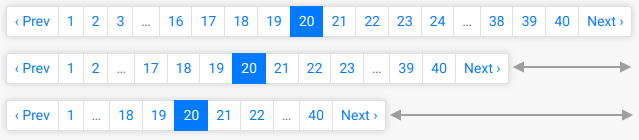

# Javascript

## Overview

A few helpers use javascript, and they are clearly recognizable by the `js` suffix:

- `pagy*_nav_js`
- `pagy*_combo_nav_js`
- `pagy_items_selector_js`

If you use any of them you should follow this documentation, if not, consider that Javascript is not used anywhere else, so you can skip this.

### How does it work?

All the `pagy*_js` helpers render their component on the client side. The helper methods serve just a minimal HTML tag that contains a `data-pagy` attribute. A small javascript file (that you must include in your assets) will take care to convert the data embedded in the `data-pagy` attribute and make it work in the browser.

You can pick and configure [a Javascript File](https://github.com/ddnexus/pagy/tree/master/lib/javascripts) depending on the environment of your app. 

**Notice** The javascript file is required only for the `pagy*_js` helpers. Just using `'data-remote="true"'` without any `pagy*_js` helper works without any javascript file.

### Faster performance with the oj gem

Although it's not a requirement, you should consider adding the `gem 'oj'` to your Gemfile. When available, Pagy will automatically use it to boost the performance. (Notice: It does nothing for normal, non-js helpers.)

### CAVEATS

#### Overriding

Any `*_js` helper is composed by a HTML part and some javascript code that work in sync. Overriding is likely going to break in the future as soon as the relation between the helper and the functions will change in a next release (e.g. arguments, naming, etc.), so overriding is not recommended.

#### HTML fallback

Notice that if the client browser doesn't support Javascript or if it is disabled, certain helpers will serve nothing useful for the user. If your app does not require Javascript support and you still want to use javascript helpers, then you should consider implementing your own HTML fallback. For example:

```erb
<noscript><%== pagy_nav(@pagy) %></noscript>
```

# Javascript Navs

The following `pagy*_nav_js` helpers:

- `pagy_nav_js`
- `pagy_bootstrap_nav_js`
- `pagy_bulma_nav_js`
- `pagy_foundation_nav_js`
- `pagy_materialize_nav_js`
- `pagy_semantic_nav_js`

look like a normal `pagy*_nav` but have a few added features:

1. Client-side rendering
2. Optional responsiveness
3. Better performance and resource usage _(see [Maximizing Performance](../how-to.md#maximize-performance))_

Here is a screenshot (from the `bootstrap`extra) showing responsiveness at different widths:



## Installation instructions

1. Load the Javascript assets.
2. Add the relevant extra
3. Use JS helper in a View

See [extras](../extras.md) for general usage info.

#### 1. Load / Initialise Pagy Javascript

The strategy might vary, depending on what you're using: sprockets / or bundlers like (webpack-esbuild-rollup etc) / importmaps / propshaft etc - see [Javascript Readme Instructions](https://github.com/ddnexus/pagy/blob/master/lib/javascripts/README.md) for installation and initialization details.

#### 2. Add the relevant extra

In the `pagy.rb` initializer, require the specific extra for the style you want to use:

```ruby
# you only need one of the following extras
require 'pagy/extras/bootstrap'
require 'pagy/extras/bulma'
require 'pagy/extras/foundation'
require 'pagy/extras/materialize'
require 'pagy/extras/navs'
require 'pagy/extras/semantic'
require 'pagy/extras/uikit'
```

This will make available, the below helpers:

#### 3. Use the JS helper in a View

Use one of the `pagy*_nav_js` helpers in any view:

```erb
<%== pagy_nav_js(@pagy) %>
<%== pagy_bootstrap_nav_js(@pagy) %>
<%== pagy_bulma_nav_js(@pagy) %>
<%== pagy_foundation_nav_js(@pagy) %>
<%== pagy_materialize_nav_js(@pagy) %>
<%== pagy_semantic_nav_js(@pagy) %>
```

## Variables

| Variable | Description                                                        | Default |
|:---------|:-------------------------------------------------------------------|:--------|
| `:steps` | Hash variable to control multiple pagy `:size` at different widths | `false` |

### :steps

The `:steps` is an optional non-core variable used by the `pagy*_nav_js` navs. If it's `false`, the `pagy*_nav_js` will behave exactly as a static `pagy*_nav` respecting the single `:size` variable, just faster and lighter. If it's defined as a hash, it allows you to control multiple pagy `:size` at different widths.

You can set the `:steps` as a hash where the keys are integers representing the widths in pixels and the values are the Pagy `:size` variables to be applied for that width.

As usual, depending on the scope of the customization, you can set the variables globally or for a single pagy instance, or even pass it to the `pagy*_nav_js` helper as an optional keyword argument.

For example:

```ruby
# globally
Pagy::DEFAULT[:steps] = { 0 => [2,3,3,2], 540 => [3,5,5,3], 720 => [5,7,7,5] }

# or for a single instance
pagy, records = pagy(collection, steps: { 0 => [2,3,3,2], 540 => [3,5,5,3], 720 => [5,7,7,5] } )

# or use the :size as any static pagy*_nav
pagy, records = pagy(collection, steps: false )
```

```erb
or pass it to the helper
<%== pagy_nav_js(@pagy, steps: {...}) %>
```

The above statement means that from `0` to `540` pixels width, Pagy will use the `[2,3,3,2]` size, from `540` to `720` it will use the `[3,5,5,3]` size and over `720` it will use the `[5,7,7,5]` size. (Read more about the `:size` variable in the [How to control the page links](../how-to.md#control-the-page-links) section).

**IMPORTANT**: You can set any number of steps with any arbitrary width/size. The only requirement is that the `:steps` hash must contain always the `0` width or a `Pagy::VariableError` exception will be raised.

#### Setting the right sizes

Setting the widths and sizes can create a nice transition between widths or some apparently erratic behavior.

Here is what you should consider/ensure:

1. The pagy size changes in discrete `:steps`, defined by the width/size pairs.

2. The automatic transition from one size to another depends on the width available to the pagy nav. That width is the _internal available width_ of its container (excluding eventual horizontal padding).

3. You should ensure that - for each step - each pagy `:size` produces a nav that can be contained in its width.

4. You should ensure that the minimum internal width for the container div be equal (or a bit bigger) to the smaller positive width. (`540` pixels in our previous example).

5. If the container width snaps to specific widths in discrete steps, you should sync the quantity and widths of the pagy `:steps` to the quantity and internal widths for each discrete step of the container.

#### Javascript Caveats

In case of a window resize, the `pagy_*nav_js` elements on the page are re-rendered (when the container width changes), however if the container width changes in any other way that does not involve a window resize, then you should re-render the pagy element explicitly. For example:

```js
document.getElementById('my-pagy-nav-js').render();
```

# Javascript Combo Navs

The following `pagy*_combo_nav_js` offer an alternative pagination UI that combines navigation and pagination info in a single compact element:

- `pagy_combo_nav_js`
- `pagy_bootstrap_combo_nav_js`
- `pagy_bulma_combo_nav_js`
- `pagy_foundation_combo_nav_js`
- `pagy_materialize_combo_nav_js`
- `pagy_semantic_combo_nav_js`

They are the fastest and lightest `nav` on modern environments, recommended when you care about efficiency and server load _(see [Maximizing Performance](../how-to.md#maximize-performance))_.

Here is a screenshot (from the `bootstrap` extra):


## Synopsis

See [extras](../extras.md) for general usage info.

In the `pagy.rb` initializer, require the specific extra for the style you want to use:

```ruby
# you only need one of the following extras
require 'pagy/extras/bootstrap'
require 'pagy/extras/bulma'
require 'pagy/extras/foundation'
require 'pagy/extras/materialize'
require 'pagy/extras/navs'
require 'pagy/extras/semantic'
require 'pagy/extras/uikit'
```

Use the `pagy*_combo_nav_js` helpers in any view:

```erb
<%== pagy_combo_nav_js(@pagy, ...) %>
<%== pagy_bootstrap_combo_nav_js(@pagy, ...) %>
<%== pagy_bulma_combo_nav_js(@pagy, ...) %>
<%== pagy_foundation_combo_nav_js(@pagy, ...) %>
<%== pagy_materialize_combo_nav_js(@pagy, ...) %>
<%== pagy_semantic_combo_nav_js(@pagy, ...) %>
```

## Methods

### pagy*_nav_js(pagy, ...)

The method accepts also a few optional keyword arguments:

- `:pagy_id` which adds the `id` HTML attribute to the `nav` tag
- `:link_extra` which add a verbatim string to the `a` tag (e.g. `'data-remote="true"'`)
- `:steps` the [:steps](#steps) variable

**CAVEATS**: the `pagy_bootstrap_nav_js` and `pagy_semantic_nav_js` assign a class attribute to their links, so do not add another class attribute with the `:link_extra`. That would be illegal HTML and ignored by most browsers.

### pagy*_combo_nav_js(pagy, ...)

The method accepts also a couple of optional keyword arguments:

- `:pagy_id` which adds the `id` HTML attribute to the `nav` tag
- `:link_extra` which add a verbatim string to the `a` tag (e.g. `'data-remote="true"'`)

**CAVEATS**: the `pagy_semantic_combo_nav_js` assigns a class attribute to its links, so do not add another class attribute with the `:link_extra`. That would be illegal HTML and ignored by most browsers.

# Using AJAX

If you AJAX-render any of the javascript helpers mentioned above, you should also execute `Pagy.init(container_element);` in the javascript template. Here is an example for an AJAX-rendered `pagy_bootstrap_nav_js`:

In `pagy_remote_nav_js` controller action (notice the `link_extra` to enable AJAX):

```ruby
def pagy_remote_nav_js
  @pagy, @records = pagy(Product.all, link_extra: 'data-remote="true"')
end
```

In `pagy_remote_nav_js.html.erb` template for non-AJAX render (first page-load):

```erb
<div id="container">
  <%= render partial: 'nav_js' %>
</div>
```

In `_nav_js.html.erb` partial shared for AJAX and non-AJAX rendering:

```erb
<%== pagy_bootstrap_nav_js(@pagy) %>
```

In `pagy_remote_nav_js.js.erb` javascript template used for AJAX:

```js
$('#container').html("<%= j(render 'nav_js')%>");
Pagy.init(document.getElementById('container'));
```

**IMPORTANT**: The `document.getElementById('container')` argument will re-init the pagy elements just AJAX-rendered in the container div. If you miss it, it will not work.
