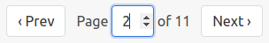

# Bulma Extra

This extra adds nav helper and templates for the Bulma CSS [pagination component](https://bulma.io/documentation/components/pagination).

## Synopsis

See [extras](../extras.md) for general usage info.

In the `pagy.rb` initializer:

```ruby
require 'pagy/extras/bulma'
```

Render the navigation links in some view...
with a fast helper:

```erb
<%== pagy_bulma_nav(@pagy) %>
<%== pagy_bulma_responsive_nav(@pagy) %>
<%== pagy_bulma_compact_nav(@pagy) %>
```

or with a template:

```erb
<%== render 'pagy/bulma_nav', locals: {pagy: @pagy} %>
```

Configure [javascript](../extras.md#javascript) if you use `pagy_bulma_responsive_nav` or `pagy_bulma_compact_nav`.

## Files

- [bulma.rb](https://github.com/ddnexus/pagy/blob/master/lib/pagy/extras/bulma.rb)
- [bulma_nav.html.erb](https://github.com/ddnexus/pagy/blob/master/lib/templates/bulma_nav.html.erb) (optional template)
- [bulma_nav.html.haml](https://github.com/ddnexus/pagy/blob/master/lib/templates/bulma_nav.html.haml) (optional template)
- [bulma_nav.html.slim](https://github.com/ddnexus/pagy/blob/master/lib/templates/bulma_nav.html.slim)  (optional template)

## Methods

This extra adds 3 nav helpers to the `Pagy::Frontend` module. You can customize them by overriding them directly in your own view helper.

### pagy_bulma_nav(pagy)

This method is the same as the `pagy_nav`/`pagy_plain_nav`, but customized for Bulma.

The `bulma_nav.*` templates produce the same output, and can be used as an easier (but slower) starting point to override it.

### pagy_bulma_compact_nav(pagy, ...)

This method is the same as the `pagy_plain_compact_nav`, but customized for the Bulma CSS framework.

Here is an example:



See more details in the [compact navs](plain.md#compact-navs) documentation.

### pagy_bulma_responsive_nav(pagy, ...)

This method is the same as the `pagy_plain_responsive_nav`, but customized for the Bulma CSS framework.

See more details in the [responsive navs](plain.md#responsive-navs) documentation.

### Optional Template Files

See [Using Templates](../how-to.md#using-templates).
