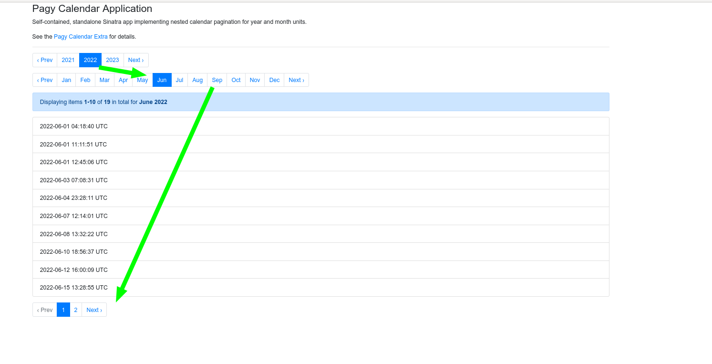

# Calendar Extra

This extra uses the `Pagy::Calendar` [subclass](../api/calendar.md) in order to paginate the collection by calendar Time units (year, month, week or day) instead of the usual number of `:items`.

It is possible to further paginate the units with regular pagination in order to limit the records to a manageable size, generating a sort of [nested pagination](#nested-pagination).

**WARNING**: _This extra has 100% of test coverage, however it's very new and its API could still change, so consider it as a version 0.x. Please, check the [Changelog](https://github.com/ddnexus/pagy/blob/master/CHANGELOG.md) for breaking changes before upgrading Pagy for minor version bumps. Patch versions are safe to upgrade without checking. (This warning will be removed as soon as the API will become stable.)_

## Synopsis

See [extras](../extras.md) for general usage info.

Require and configure it the `pagy.rb` initializer:

```ruby
require 'pagy/extras/calendar'
# Optional: customize the default
# Pagy::DEFAULT[:local_minmax] = []          # Min and max local Time period must be set by the user (better not not as default)
# Pagy::DEFAULT[:unit]         = :month      # Time unit allowed %i[year month week day]
# Pagy::DEFAULT[:week_offset]  = 0           # Day offset from Sunday (0: Sunday; 1: Monday;... 6: Saturday)
# Pagy::DEFAULT[:order]        = :asc        # Time direction of pagination
# Pagy::DEFAULT[:year_format]  = '%Y'        # strftime format for :year unit
# Pagy::DEFAULT[:month_format] = '%Y-%m'     # strftime format for :month unit
# Pagy::DEFAULT[:week_format]  = '%Y-%W'     # strftime format for :week unit
# Pagy::DEFAULT[:day_format]   = '%Y-%m-%d'  # strftime format for :day unit
```

Use it in your controllers:

```ruby
# Override the pagy_calendar_get_vars
# my_local_min_max is your own method that should return an Array with the 
# min and max Time objects from your collection, converted in the user local time
def pagy_calendar_get_vars(collection, vars)
  super
  vars[:local_minmax] ||= my_local_min_max(collection)
  vars
end

# Create the pagy_calendar_get_items  
# my_page_of_records is your own scope or method that should 
# select the records with time <= pagy.utc_from and < pagy.utc_to
def pagy_calendar_get_items(collection, pagy)
  collection.my_page_of_records(pagy.utc_from, pagy.utc_to)
end

# in your actions...
@pagy, @records = pagy_calendar(collection, ...)
```

## Overview

`Pagy::Calendar` paginates by calendar time units, and it must know the total time span to paginate. That means knowing the minimum and maximum times of the collection to paginate.

But a time can be stored in a field with one name or another, or in a joined table, or be the result of a query calculation, or who knows how else in different storage systems. `Pagy::Calendar` does not impose any "conventional" way to store your data, so it needs you to implement a couple of simple methods.

### 1. Setting the :local_minmax variable

Since the pagination is UI/presentation logic, all the time calculations must be done in the local time of your user in order to make sense. `Pagy::Calendar` bases all its time calculations on the two `Time` objects that you provide with the `:local_minmax` Array variable, so you must ensure that they are converted in the local time of your user. In order to prevent mistakes, Pagy will raise an exception if you pass UTC times.

You have a couple of ways of setting the `:local_minmax` Array variable. You could set the `Pagy::DEFAULT[:local_minmax]` to a default static value, but that makes sense only for a very static environment and users on the same time zone, which is quite unusual in the real words. 

The other way is setting it dynamically for each instance. You can do so by overriding the `pagy_calendar_get_vars` as indicated in the [Synopsis](#synopsis). Just call your own method that will extract and convert to local time the two times from your collection and set the `:local_minmax` variable dynamically.

### 2. Getting the records for the time unit

Pagy knows when the requested page unit starts and finishes and it calculates the `utc_from` and `utc_to` Time objects. What it cannot know is how to find the times values to query in your collection. That is why you must implement the `pagy_calendar_get_items` method as indicated in the [Synopsis](#synopsis). Just select the records with your field time `<= pagy.utc_from` and `< pagy.utc_to` and you are good to go.

**IMPORTANT**: The logic for querying your collection shown in the following pseudo code is extremely important to get the right records, including an empty page when you use the `:empty_page` mode with the [overflow extra](overflow.md)
  
```
# please adapt this logic to your actual query (and convert the time if your storage time is not UTC)

collection_utc_time >= pagy.utc_from && collection_utc_time < pagy.utc_to
```

#### Time zone conversions

As the name tries to suggest, `pagy.utc_from` and `pagy.utc_to` are UTC `Time` objects.

That is the internal time zone used by most storages, but if that is not your case, you must ensure that they will get converted to the appropriate time zone (automatically by your ORM/driver/client or manually) before executing your query.

## Variables and Accessors

See [Pagy::Calendar](../api/calendar.md#variables)

## Files

- [calendar.rb](https://github.com/ddnexus/pagy/blob/master/lib/pagy/extras/calendar.rb)

## Methods

All the methods in this module are prefixed with the `"pagy_calendar"` string in order to avoid any possible conflict with your own methods when you include the module in your controller. They are also all private, so they will not be available as actions. The methods prefixed with the `"pagy_calendar_get_"` string are sub-methods/getter methods that are intended to be overridden, not used directly.

### pagy_calendar(collection, vars)

This method is the same as the generic `pagy` method (see the [pagy doc](../api/backend.md#pagycollection-varsnil)), however the variables that you can pass are different from the `Pagy`  instances (see [Pagy::Calendar variables](../api/calendar.md#variables) for details).

### pagy_calendar_get_vars(_collection, vars)

This sub-method is similar to the `pagy_get_vars` sub-method, but it is called only by the `pagy_calendar` method (see the [pagy_get_vars doc](../api/backend.md#pagy_get_varscollection-vars)). You should override it in order to implement dynamic pagination periods based on the time-span of the paginated collection as indicated in the [Synopsis](#synopsis).

### pagy_calendar_get_items(collection, pagy)

This sub-method is similar to the `pagy_get_items` sub-method, but it is called only by the `pagy_calendar` method (see the [pagy_get_items doc](../api/backend.md#pagy_get_itemscollection-pagy)). You **must** implement it in your own controller in order to get the paginated records as indicated in the [Synopsis](#synopsis).

## Customization

### Nested pagination

A calendar pagination could generate pages of huge size, which frankly would be quite self defeating for a pagination gem.

For example: a `:year` page might contain an unspecified big number of records since in calendar pagination we get all the records that fall between two points in time, so we have no idea about how many records we are about to pull.

So if the collection has units of unpredictable big size (which is usually a wise assumption), you can re-paginate it. For example:

```ruby
# Paginate by year (or any other unit)
@pagy_year, year_page = pagy_calendar(collection, unit: :year, page_param: :year_page)
# Paginate the year_page again by number of items 
@pagy, @records = pagy(year_page)
```
```erb
<%== pagy_nav(@pagy_year) %>
<%== pagy_info(@pagy) %> for <%== @pagy_year.label %>

... display your list of records ...

<%== pagy_nav(@pagy) %>
```

Notice that the nesting could be also multi-level and the number of queries needed with not increase. See the single file [pagy_calendar_app.ru](https://github.com/ddnexus/pagy/blob/master/apps/pagy_calendar_app.ru) for a working example of 3 nesting levels: `:year` + `:month` + standard pagination. 

You can get a quick demo on your machine: 

```shell
git clone --depth 1 https://github.com/ddnexus/pagy
cd pagy
rackup -o 0.0.0.0 -p 8080 apps/pagy_calendar_app.ru
```

Then point your browser to `http://0.0.0.0:8080`.



### Order

If you set `:order` to `:desc`, the `Pagy::Calendar` will reverse the order of the page units (e.g. May, then April, then March, ...), but keep in mind that you still have to reverse the records in the page since pagy has no control over that (indeed it's your code that pulls the records).

### Label format

When you use this extra with a standard pagination bar you will see that each page link is conveniently labeled with the specific `Time` period it refers to. You can change the time format to your needs by just setting any of the `:*_format` variables wth a standard `strftime` format.

You can also get the [current page label](../api/calendar.md#labelformat--nil) with `@pagy.label`, which might be useful to use in your UI.

### I18n localization

Pagy implements its own faster version of the `translate` method, but does not provide any built-in support for the `localize` method.

If you need to use formats with unit names (weekday names, month names, etc.) that require localization in an I18n application, you need to use the [i18n extra](i18n.md), which delegates the localization to the `I18n` gem. In that case a change in the global `I18n.locale` will automatically localize all the time labels accordingly. 
