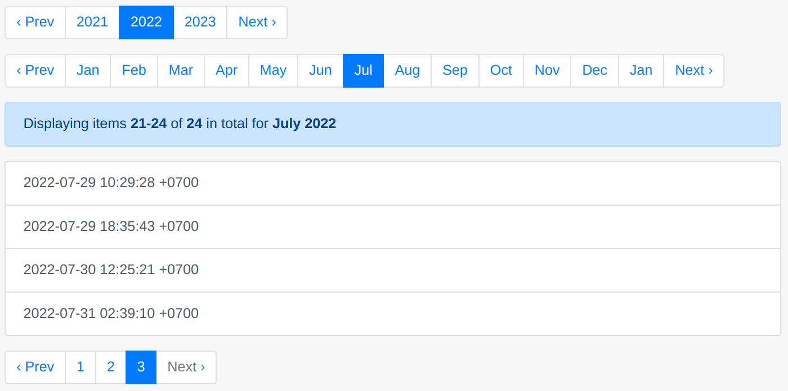

# Calendar Extra

This extra is a sort of wrapper around any pagy backend extra. It adds single or multiple chained calendar navigation bars that act as Calendar filters on the collection records, placing each record in its time unit (Year, Month, Week, Day). 


_Screenshot from the single-file self-contained [pagy_calendar_app.ru](https://github.com/ddnexus/pagy/blob/master/apps/pagy_calendar_app.ru) demo_

**WARNING**: _This extra has 100% of test coverage, however it's very new and its API could still change, so consider it as a version 0.x. Please, check the [Changelog](https://github.com/ddnexus/pagy/blob/master/CHANGELOG.md) for breaking changes before upgrading Pagy for minor version bumps. Patch versions are safe to upgrade without checking. (This warning will be removed as soon as the API will become stable.)_

## Use cases

This extra makes sense when your collection has some time continuity and you want to provide a simple chronological browsing. For example: a movie catalog could allow the user to browse all the movies by years, or you may want to browse a long list of events by jumping and narrowing between years, months, days.

On the other hand it does not make much sense when you are just showing the result of a search with just a few sparse results scattered over a possibly long period of time. In that case the calendar extra has a `skip` switch that can skip the calendar business and fallback to the regular pagination. You don't have to keep two different sets of controllers/actions/views for wide browsing or narrow searching: you can just switch from one to the other with a parameter.

## Synopsis

See [extras](../extras.md) for general usage info.

Require and configure it in the `pagy.rb` initializer:

```ruby
require 'pagy/extras/calendar'
# Optional: customize the default
```

Implement and use it in your controllers:

```ruby
# Define the pagy_calendar_minmax method in your application
# It must return an Array with the minimum and maximum local Time objects from the collection,
# converted to the local time of the user
def pagy_calendar_minmax(collection)
  return_minmax_array_using(collection)
end

# Define the pagy_calendar_filtered method in your application
# It receives the main collection and must return a filtered version of it.
# The filter logic must be equivalent to {utc_time >= utc_from && utc_time < utc_to}
def pagy_calendar_filtered(collection, utc_from, utc_to)
  return_filtered_collection_using(collection, utc_from, utc_to)
end

# Use it in your actions:
@calendar, @pagy, @records = pagy_calendar(collection, year:  { size:  [1, 1, 1, 1], ... },
                                                       month: { size:  [0, 12, 12, 0], ... },
                                                       pagy:  { items: 10, ...})
```

Use the calendar and pagy objects in your views:

```erb
<!-- calendar pagination -->
<%== pagy_nav(@calendar[:year]) %>
<%== pagy_nav(@calendar[:month]) %>

<!-- pagy info extended for the calendar unit -->
<%== pagy_info(@pagy) %> for <%== @calendar[:month].label(format: '%B %Y') %>

... display @records ...

<!-- standard pagination of the selected month -->
<%== pagy_nav(@pagy) %>
```

**Notice** For a more complete and detailed example, see the [pagy_calendar_app.ru](https://github.com/ddnexus/pagy/blob/master/apps/pagy_calendar_app.ru).

## Usage

Since the time can be stored or calculated in many different ways in different collections, its implementation requires you to implement a couple of simple methods in your app, and configure the objects that this extra will create and coordinate for you.

The whole usage boils down to 3 simple steps:

1. Define the [pagy_calendar_mimax](#pagy_calendar_minmaxcollection) method in your controller
2. Define the [pagy_calendar_filtered](#pagy_calendar_filteredcollection-utc_from-utc_to) method in your controller
3. Configure the UI using the [pagy_calendar](#pagy_calendarcollection-conf) method in your action

You can play with a quick demo app, working without any additional configuration with:

```shell
git clone --depth 1 https://github.com/ddnexus/pagy
cd pagy
rackup -o 0.0.0.0 -p 8080 apps/pagy_calendar_app.ru
```

Then point your browser to `http://0.0.0.0:8080`.

## Variables and Accessors

See [Pagy::Calendar](../api/calendar.md#variables)

## Files

- [calendar.rb](https://github.com/ddnexus/pagy/blob/master/lib/pagy/extras/calendar.rb)

## Methods

All the methods in this module are prefixed with the `"pagy_calendar"` string in order to avoid any possible conflict with your own methods when you include the module in your controller. They are also all private, so they will not be available as actions.

### pagy_calendar(collection, conf)

This method is somehow similar to the generic `pagy` method (see the [pagy doc](../api/backend.md#pagycollection-varsnil)), but it handles multiple levels of pagy objects through the `conf` argument. It returns an array with one more item than the usual two. E.g.: `@calendar, @pagy, @results = pagy_calendar(...)`.

### `collection`

The `pagy_calendar` method can handle any type of collection (e.g. `ActiveRecord`, `ElasticSearchRails`, `Searchkick`, `Meilisearch`, ...) with any of the pagy backend extras (e.g. builtin backend, `arel`, `array`, `countless`, `elasticsearch_rails`, `searchkick`, `meilisearch`, ...).

You can configure the backend extra method that will handle the `collection` by setting an optional `:backend` variable in the [pagy conf](#pagy-conf). E.g: `backend: :pagy_searchkick`. The `collection` argument is exactly what you would pass to the backend method. 

### `conf` argument

The `conf` argument must be a Hash structure with the keys representing the type of configuration and the values being the Hash of vars that you want to pass to the creation of the specific object (or a simple flag). The `conf` hash can be composed by the following type of configurations:

#### Calendar conf

The calendar configuration determines the time objects generated for the calendar. These are used for filtering the collection to the selected time units.

You can add one or more levels with keys like `:year`, `:month`, `:week`, `:day`. Each key must be set to the hash of the variables that will be used to initialize the relative `Pagy::Calendar::*` object. Use an empty hash for default values. E.g.: `year: {}, month: { size: [0, 12, 12, 0] }`.

**Restrictions**: The `:page`, `:page_param`, `:params` and `:minmax` variables for the calendar objects are managed automatically by the extra. Setting them explicitly has no effect. (See also [calendar params](#calendar-params) for solutions in case of conflicts)

#### Pagy conf

This is the optional configuration of the final pagination object which is always used regardless the calendar is skipped or not.

You can pass one optional `:pagy` key, set to the hash of variables to initialize a `Pagy` object. It has none of the restriction mentioned in the [calendar conf](#calendar-conf).

Besides the usual pagy variables, you can add a `:backend` variable, set to the name of the backend extra method that you want to use for managing the collection. E.g.: `pagy: { backend: :pagy_searchkick, items: 10, ... }`. 

If the `:pagy` key/value is omitted, a default `Pagy` instance will be created by the default `:pagy` backend method.

#### Skip conf

You can add an optional `:skip` flag to the `conf` hash. When set to a true value (i.e. not `nil` or `false`) it will completely skip the calendar creation and the filtering of the collection. That can switch ON or OFF the calendar UI, depending on its usefulness in different conditions (see the [use cases](#use-cases)).

Take a look at the [pagy_calendar_app.ru](https://github.com/ddnexus/pagy/blob/master/apps/pagy_calendar_app.ru) for a simple example of its manual implementation in the UI.

### pagy_calendar_minmax(collection)

**This method must be implemented in the application.**

It receives a `collection` argument and it should use it to return an array with its min and max time, **expressed in local user Time**.

Depending on the type of storage, the `collection` argument can contain a different kind of object:

#### ActiveRecord managed storages

If you use `ActiveRecord` the `collection` is going to be an `ActiveRecord::Relation` object. You can chain it to whatever other scope you need to get the min and max time and return them as a 2 items array. (Just ensure they are expressed in user local time).

#### Search frameworks storages

_If you use `ElasticSearchRails`, `Searchkick`, `Meilisearch` the `collection` argument is just the Array of the captured search arguments that you passed to the `Model.pagy_search` method. That array is what pagy uses internally to setup its variables before passing it to the standard `Model.search` method to do the actual search._

So you should use what you need from the `collection` array and do your own `Model.search(...)` in order to get the min and max time and return them as a 2 items array. (Just ensure they are expressed in user local time).

**Notice that this method must not change the original `collection` Array**.

### pagy_calendar_filtered(collection, utc_from, utc_to)

**This method must be implemented in the application.**

It receives the main collection and must return a filtered version of it using the `utc_from` and `utc_to` time objects.

**IMPORTANT**: The logic for querying your collection shown in the following pseudo code is extremely important to get the right records, including an empty page when you use the `:empty_page` mode with the [overflow extra](overflow.md). You should adapt its syntax to your storage:
 
```
collection_utc_time >= utc_from && collection_utc_time < utc_to
```

**Notice**: UTC time is the internal time zone used by most storages, but if that is not your case, you must ensure that they will get converted to the appropriate time zone (automatically by your ORM/driver/client or manually).

Depending on the type of storage, the `collection` argument can contain a different kind of object:

#### ActiveRecord managed storages

If you use `ActiveRecord` the `collection` is going to be an `ActiveRecord::Relation` object. You can chain it to whatever other scope you need in order to get a new scope filtered with the logic indicated above and return it.

#### Search frameworks storages

_If you use `ElasticSearchRails`, `Searchkick`, `Meilisearch` the `collection` argument is just the Array of the captured search arguments that you passed to the `Model.pagy_search` method. That array is what pagy uses internally to setup its variables before passing it to the standard `Model.search` method to do the actual search._

So in order to filter the actual search with the `utc_from` and `utc_to` Time objects, you should simply add your filtering to the relevant item of the array, and return the modified array. Pagy will use it to do the actual search.

## Customization

### Time Order

If you set `:time_order` to `:desc`, the `Pagy::Calendar` will reverse the order of the page units (e.g. May, then April, then March, ...), but keep in mind that you still have to reverse the records in the page since pagy has no control over that (indeed it's your code that pulls the records).

### Week Offset

If you use the `:week` time unit (`Page::Calendar::Week`) consider that different locales have different start of the week. You can adjust the starting day of the week by setting the `:week_offset` to the day offset from Sunday (0: Sunday; 1: Monday;... 6: Saturday).

### Calendar params

This extra handles the params of its objects automatically, and you should not need to customize them, unless they clash with other params in your requests. In that case you have a couple of alternatives:

- Renaming the clashing param of your app
- Passing a custom `:page_param` to the [pagy conf](#pagy-conf). That will internally rename the `:page_param` vars and update the `:params` procs of all the calendar objects accordingly.

## View

You can use the calendar objects with any `pagy_*nav`, `pagy_*nav_js` helpers or any templates in your views.

 Notice however that since the `pagy_*combo_nav_js` keeps into account only page numbers and not labels, it is not very useful (if at all) with `Pagy::Calendar::*` objects.

### Label format

Each page link in the calendar navs is conveniently labeled with the specific `Time` period it refers to. You can change the time format to your needs by just setting any of the `:*_format` variables with a standard `strftime` format. (See the [Pagy::Calendar variables](../api/calendar.md#variables))

You can also get the [current page label](../api/calendar.md#labelopts) with e.g.: `@calendar[:month].label`, which might be useful to use in your UI.

### I18n localization

Pagy implements its own faster version of the i18n `translate` method, but does not provide any built-in support for the i18n `localize` method.

If you need to localize the unit labels in other locales you need to use the [i18n extra](i18n.md), which delegates the localization to the `I18n` gem. In that case a change in the global `I18n.locale` will automatically localize all the time labels accordingly. 
