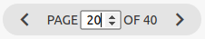

# Materialize Extra

This extra adds 3 nav helpers for the Materialize CSS [pagination component](https://materializecss.com/pagination.html).

## Synopsis

See [extras](../extras.md) for general usage info.

In the `pagy.rb` initializer:

```ruby
require 'pagy/extras/materialize'
```

Render the navigation links in some view...
with a fast helper:

```erb
<%== pagy_materialize_nav(@pagy, ...) %>
<%== pagy_materialize_nav_js(@pagy, ...) %>
<%== pagy_materialize_combo_nav_js(@pagy, ...) %>
```

See [Javascript](../api/javascript.md) if you use `pagy_materialize_nav_js` or `pagy_materialize_combo_nav_js`.

## Files

- [materialize.rb](https://github.com/ddnexus/pagy/blob/master/lib/pagy/extras/materialize.rb)

## Methods

This extra adds 3 nav helpers to the `Pagy::Frontend` module. You can customize them by direct overriding in your own view helper.

### pagy_materialize_nav(pagy)

This method is the same as the `pagy_nav`, but customized for Materialize.

See the [pagy_nav(pagy, ...)](../api/frontend.md#pagy_navpagy-) documentation.

### pagy_materialize_nav_js(pagy, ...)

See the [Javascript Navs](../api/javascript.md#javascript-navs) documentation.

### pagy_materialize_combo_nav_js(pagy, ...)



See the [Javascript Combo Navs](../api/javascript.md#javascript-combo-navs) documentation.
