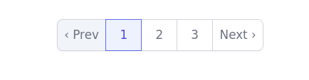

# Tailwind Extra Styles

Ready to use style snippet for tailwind.

Tailwind allows to apply styles to any DOM element, so you don't actually need a special extra to produce a different output. You can use the standard unstyled pagy helpers: i.e. the default `pagy_nav` and the `pagy_nav_js`and `pagy_nav_combo_js` provided by the [navs](navs.md) extra, and apply the styles to their classes.

## Synopsis

See the [navs](navs.md) extra if you use `pagy_nav_js` or `pagy_combo_nav_js`.

Some sample styles you can copy / customize:

!!!warning Where to paste?

With normal CSS files, you can easily "import" one stylesheet into another. If you want Tailwind to do the same, then you would need [to configure tailwind to do so](https://tailwindcss.com/docs/using-with-preprocessors#build-time-imports) or you could simply paste the following into your `tailwind.css` file.
!!!

+++ Style 1


||| SCSS rules
```scss
@import "~tailwindcss/base"; /* Add the following markup AFTER your import statements*/

.pagy-nav,
.pagy-nav-js {
  @apply flex space-x-2;
}

.pagy-nav .page a,
.pagy-nav .page.active,
.pagy-nav .page.prev.disabled,
.pagy-nav .page.next.disabled,
.pagy-nav-js .page a,
.pagy-nav-js .page.active,
.pagy-nav-js .page.prev.disabled,
.pagy-nav-js .page.next.disabled {
  @apply block rounded-lg px-3 py-1 text-sm text-gray-500 font-semibold bg-gray-200 shadow-md;
  &:hover{
    @apply bg-gray-300;
  }
  &:active{
    @apply bg-gray-400 text-white;
  }
}

.pagy-nav .page.prev.disabled,
.pagy-nav .page.next.disabled,
.pagy-nav-js .page.prev.disabled,
.pagy-nav-js .page.next.disabled {
  @apply text-gray-400 cursor-default;
  &:hover {
    @apply text-gray-400 bg-gray-200;
  }
  &:active {
    @apply text-gray-400 bg-gray-200;
  }
}

.pagy-nav .page.active,
.pagy-nav-js .page.active {
  @apply text-white cursor-default bg-gray-400;
  &:hover {
    @apply text-white bg-gray-400;
  }
  &:active {
    @apply bg-gray-400 text-white;
  }
}


.pagy-combo-nav-js {
  @apply flex max-w-max rounded-full px-3 py-1 text-sm text-gray-500 font-semibold bg-gray-200 shadow-md;
}

.pagy-combo-nav-js .pagy-combo-input {
  @apply bg-white px-2 rounded-sm
}

.pagy-combo-nav-js .page.prev,
.pagy-combo-nav-js .page.next {
  &:hover {
    @apply text-gray-800;
  }
  &:active {
    @apply text-gray-800;
  }
}

.pagy-combo-nav-js .page.prev.disabled,
.pagy-combo-nav-js .page.next.disabled {
  @apply text-gray-400 cursor-default;
}
```
|||


+++ Style 2



||| CSS Rules
```scss
@import "~tailwindcss/base"; /* Add the following markup AFTER your import statements*/

.pagy-nav.pagination {
  @apply isolate inline-flex -space-x-px rounded-md shadow-sm
}

.page.next a {
  @apply relative inline-flex items-center rounded-r-md border border-gray-300 bg-white px-2 py-2 text-sm font-medium text-gray-500 hover:bg-gray-50 focus:z-20
}

.page.prev a {
  @apply relative inline-flex items-center rounded-l-md border border-gray-300 bg-white px-2 py-2 text-sm font-medium text-gray-500 hover:bg-gray-50 focus:z-20;
}

.page.next.disabled {
  @apply relative inline-flex items-center rounded-r-md border border-gray-300 bg-slate-100 px-2 py-2 text-sm font-medium text-gray-500 hover:bg-gray-50 focus:z-20
}

.page.prev.disabled {
  @apply relative inline-flex items-center rounded-l-md border border-gray-300 bg-slate-100 px-2 py-2 text-sm font-medium text-gray-500 hover:bg-gray-50 focus:z-20;
}

.page a, .page.gap {
  @apply bg-white border-gray-300 text-gray-500 hover:bg-gray-50 relative inline-flex items-center border px-4 py-2 text-sm font-medium focus:z-20
}

.page.active {
  @apply z-10 border-indigo-500 bg-indigo-50 text-indigo-600 relative inline-flex items-center border px-4 py-2 text-sm font-medium focus:z-20
}

```
|||

+++


