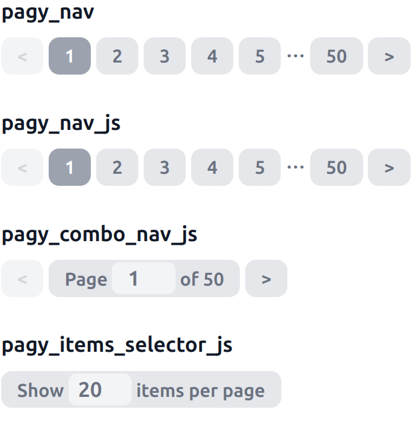

# Stylesheet

{width=300}

## Overview

For all its own interactive helpers shown above, the pagy gem includes a few stylesheet files that you can download, link or
copy.

!!!warning
You don't need any stylesheet if you use tag components with `:bootstrap` or `:bulma` styles
!!!

### HTML Structure

In order to ensure a minimalistic valid output, still complete with all the ARIA attributes, we use a single line with the minimum
number of tags and class attributes that can identify all the parts of the nav bars:

- The output of `nav_tag` and `nav_js_tag` helpers, is a series of `a` tags inside a wrapper `nav` tag
- The disabled links are so because they are missing the `href` attributes
- The `pagy nav` and `pagy nav-js` classes are assigned to the `nav` tag
- The `current` and `gap` classes are assigned to the specific `a` tags

!!! Notice

- The stylesheets target the disabled `a` tags by using the `pagy a:not([href])` selector
- You can make the `gap` look like the other pages by removing the `:not(.gap)`
- You can target the previous and next links by using `pagy a:first-child` and `pagy a:last-child` pseudo classes

!!!

!!!success 
You can totally transform the stylesheets below by just editing the content inside the curly brackets, usually leaving
the rest untouched.
!!!

+++ pagy.scss

[!file](../gem/stylesheets/pagy.scss)

```ruby 
stylesheet_path = Pagy::ROOT.join('stylesheets/pagy.scss')
```

:::code source="/gem/stylesheets/pagy.scss" title="pagy.scss":::

+++ pagy.css

[!file](../gem/stylesheets/pagy.css)

```ruby 
stylesheet_path = Pagy::ROOT.join('stylesheets/pagy.css')
```

:::code source="/gem/stylesheets/pagy.css" title="pagy.css":::

+++ pagy.tailwind.css

[!file](../gem/stylesheets/pagy.tailwind.css)

```ruby 
stylesheet_path = Pagy::ROOT.join('stylesheets/pagy.tailwind.css')
```

:::code source="/gem/stylesheets/pagy.tailwind.css" title="pagy.tailwind.css":::

+++

[!button corners="pill" variant="success" text=":icon-play: Try it now!"](/docs/Practical%20Guide/playground.md#3-demo-app)
