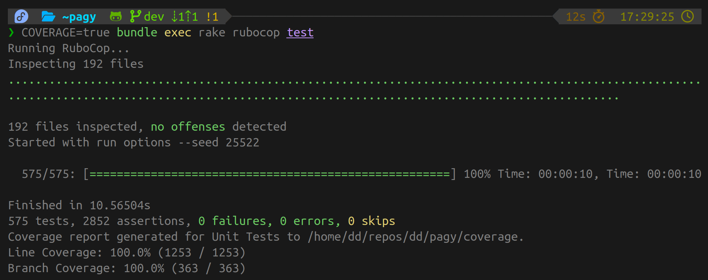

# Ruby Test Environment

Ruby is tested with [`minitest`](https://github.com/minitest/minitest) through `rake` tasks. It also uses [`holdify`](https://github.com/ddnexus/holdify) as a snapshot system.

## Prerequisite

- Install the gems: `bundle install`
- E2e tests use your local Chrome

No other setup required.

## Test subtasks

```
rake test        <-- All Unit and E2e
rake test:unit   <-- All Unit
rake test:e2e    <-- All E2e

rake test:e2e:calendar
rake test:e2e:demo
rake test:e2e:keynav
rake test:e2e:rails
rake test:e2e:repro
```

## Run all checks

To get green light for PRs, just run them all in ~10secs...

`COVERAGE=true bundle exec rake rubocop test`


